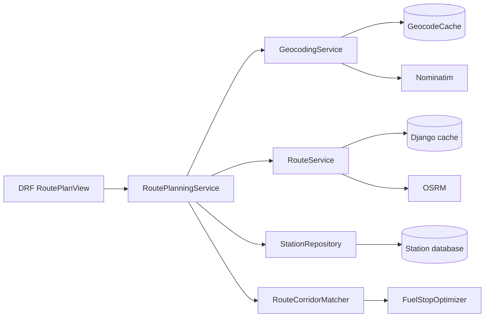

# Architecture

## Status

This document describes the implemented application in this repository. The public HTTP contract is `POST /api/v1/routes/`; the supplied CSV is imported through a management command and station coordinates are enriched separately.

## High-level flow



The external-call budget for one uncached request is at most two location-geocoding calls plus one routing call. Fuel stations are never geocoded or routed individually during an API request. Warm geocoding and route caches reduce those calls to zero.

## Actual project structure

```text
manage.py
src/
  config/
    settings/{base,local,production}.py
    urls.py, asgi.py, wsgi.py
  apps/
    core/                         health endpoint
    stations/                     models, import, geocoding, repository
    routing/
      api/                        DRF serializers/views/URLs
      providers/                  routing provider adapters
      domain.py                   coordinates and route results
      services.py                 cached routing service
      matching.py                 route corridor matching
      fuel.py                     fuel planning
      planning.py                 request orchestration
tests/                            unit and API tests
postman/                          portable Postman collection
scripts/                          deterministic local benchmark
```

## API layer

`RoutePlanView` validates the JSON request with `RouteRequestSerializer`, calls the configured `RoutePlanningService`, validates the response shape with nested serializers, and maps domain/provider failures to stable HTTP errors. It does not contain routing, geospatial, or fuel business logic.

The current request contract is:

```json
{
  "start": "New York, NY",
  "destination": "Chicago, IL"
}
```

The endpoint is `POST /api/v1/routes/`. The health endpoint is `GET /api/v1/health/`.

## Routing

`RoutingProvider` is the provider boundary. `OsrmRoutingProvider` performs one request to:

```text
{OSRM_BASE_URL}/route/v1/{OSRM_PROFILE}/{start_lon},{start_lat};{destination_lon},{destination_lat}
```

with `alternatives=false`, `steps=false`, `overview=full`, and `geometries=geojson`. The adapter validates status, metrics, coordinate ranges, and GeoJSON `LineString` geometry before returning a `RouteResult`.

`RouteService` creates a deterministic SHA-256 cache key from start coordinates, destination coordinates, profile, and options. It rechecks the cache inside a process-level single-flight lock so simultaneous cold requests in one worker do not duplicate the provider call. A shared cache/lock is still recommended for multiple production workers.

## Geocoding

`GeocodingService` persists successful and failed results in `GeocodeCache`, keyed by provider and normalized query. Start and destination inputs are cached before routing. Station geocoding is an explicit `geocode_stations` management command and is never triggered by the route endpoint.

The Nominatim adapter supplies a User-Agent, timeout, throttling interval, and bounded retries. Provider results are validated before becoming station or route coordinates. Cache writes handle concurrent unique-key races without returning a database integrity error to the caller. The in-process cache lock prevents duplicate misses within one service instance; multi-worker deployments should use shared coordination if strict upstream call suppression is required.

## Station data

The CSV schema is normalized into `Station`, `StationAlias`, and `FuelPriceObservation`. Station identity is normalized OPIS ID plus address, city, and state. Source observations remain auditable; the canonical station price/display fields are updated deterministically in file order. Positive retail prices are enforced in application validation and database constraints.

`StationRepository` reads only successfully geocoded, positive-price stations. It applies a conservative latitude/longitude bounding box around the route in SQL and streams rows with `QuerySet.iterator()`. The station index covers geocode status and coordinates.

## Route corridor matching

`RouteCorridorMatcher` converts the provider GeoJSON into ordered route segments. It builds a Shapely `STRtree` in a local miles-based coordinate approximation, queries nearby segments, then performs a distance-aware local projection for each candidate.

The default corridor is five miles. Each match preserves station identity, coordinates, price, distance along the route, and distance from the route. Stations before the route start, after the destination, invalid coordinates, invalid prices, and stations outside the corridor are excluded. Candidates are sorted by route distance.

Redundant records at essentially the same route position and coordinates are collapsed by retaining the lower price, then station ID as a deterministic tie-breaker. Duplicate collapse uses a route-position sliding window rather than comparing every candidate with every retained candidate.

The projection is an approximation, not a road-access calculation. A future production version could use PostGIS and/or route selected station access roads, but that would add complexity and external calls outside the assessment's one-route-call preference.

## Fuel optimization

The implemented vehicle assumptions are:

- maximum range: 500 miles;
- fuel efficiency: 10 MPG;
- tank capacity: 50 gallons (`500 / 10`);
- starting fuel: a full 50-gallon tank by default;
- destination reserve: zero gallons required;
- partial purchases: allowed.

The optimizer orders route candidates and precomputes the first strictly cheaper station ahead using a monotonic stack. It then consumes fuel to each station and buys only enough to reach that cheaper station when it is within 500 miles. If no cheaper station is reachable, it buys enough to reach the farthest useful point within range, capped by tank capacity and destination distance. Fuel never becomes negative, a tank is never exceeded, and an infeasible gap raises `FuelOptimizationError`.

This policy is minimum-cost for the stated continuous-fuel model on the one selected route. It is not a global road-route optimizer and does not model access-road detours, traffic, or alternate OSRM routes. Price ties are deterministic. Prices and costs use `Decimal`; route distances remain provider/geospatial floating-point measurements and are converted at the fuel boundary.

Candidate preparation is `O(n log n)` due to sorting. Next-cheaper lookup and the optimizer pass are `O(n)`. The remaining local cost is route geometry matching.

The detailed result contract and examples are in [`FUEL_OPTIMIZATION.md`](FUEL_OPTIMIZATION.md).

## Error handling and logging

Provider adapters translate network errors, non-success responses, invalid JSON, malformed metrics, and invalid geometry into typed internal exceptions. The API returns:

- `400 INVALID_REQUEST` for request validation failures;
- `404 LOCATION_NOT_FOUND` for failed location geocoding;
- `422 NO_FEASIBLE_FUEL_PLAN` when the destination cannot be reached with available stations;
- `502 ROUTING_PROVIDER_ERROR` for routing-provider failures;
- `500 INTERNAL_ERROR` for unexpected failures.

Responses include a request ID. Logs include structured request IDs and safe error types; user location strings, provider URLs, and raw upstream exception details are not logged by the provider adapters.

## Configuration and deployment

Local development uses SQLite and Django's local-memory cache. Docker Compose uses PostgreSQL, waits for its health check, runs migrations through `docker-entrypoint.sh`, and starts Gunicorn as a non-root user. The production settings enforce a real secret key, HTTPS-related security settings, and configurable hosts.

The container does not import the CSV during image build. Mount the supplied file into a one-off command and run `import_fuel_stations`; this keeps the image deterministic and avoids data/API work during startup.

For multiple workers, use a shared cache such as Redis and consider a shared distributed lock for strict route-cache stampede protection. This is a deployment improvement, not required for the assessment's local path.

## Testing and observability

Tests mock all external providers and cover import validation/idempotency, geocoding persistence and failure caching, routing parsing and cache hits, route corridor boundaries, optimizer range/cost behavior, API errors, and response schema. Run:

```powershell
python manage.py test
python -m coverage run --branch manage.py test
python -m coverage report -m
ruff check .
mypy
```

The benchmark in `scripts/benchmark_pipeline.py` reports local planning time, candidate reduction, optimizer time, and external-call counts without network access. Production monitoring should add p50/p95 latency, provider latency/error rates, cache hit rates, candidate counts, and no-feasible-plan counts.
