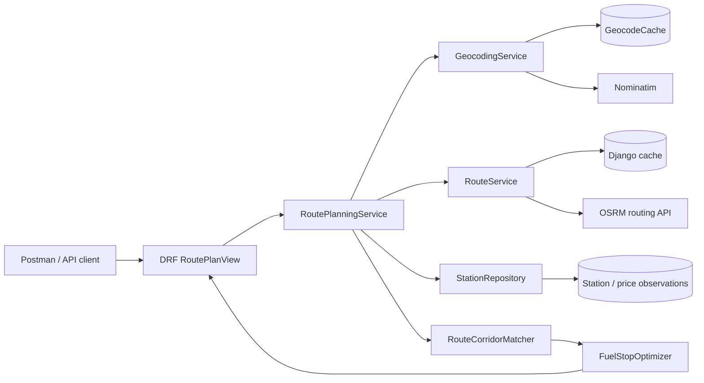

# Backend Django Engineer Assessment

## Overview

This service accepts two US locations and returns a driving route with fuel stops selected from the supplied station-price dataset.

The request pipeline is split into external and local work:

1. Geocode the two requested locations, using a persistent cache.
2. Request one driving route from OSRM, using an application cache.
3. Filter the local station dataset to a corridor around the route.
4. Select cost-aware fuel stops locally.
5. Return route geometry, fuel stops, gallons, and cost.

There is no frontend. The API is intended to be demonstrated with Postman or another HTTP client.

## Features

- Django and Django REST Framework API.
- `GET /api/v1/health/` liveness endpoint.
- `POST /api/v1/routes/` route and fuel-plan endpoint.
- OSRM routing provider with GeoJSON geometry and one request per uncached route.
- Provider abstractions for routing and geocoding.
- Persistent location and station geocode caching.
- Idempotent CSV ingestion with validation, duplicate handling, and audit observations.
- Route corridor matching using Shapely and an indexed segment search.
- 500-mile vehicle range, 10 MPG, partial refueling, and Decimal cost arithmetic.
- Structured errors, request IDs, timeouts, retries, and safe logging.
- SQLite for local development and PostgreSQL in Docker Compose.
- Automated tests with mocked external services.
- Docker image running the application as a non-root user.

## Architecture

The API layer is intentionally thin. Orchestration lives in application services; routing, geocoding, station access, matching, and optimization are replaceable components.



The main domain boundaries are:

- `apps.routing.api`: serializers, HTTP status mapping, and response formatting.
- `apps.routing.planning`: request-level orchestration.
- `apps.routing.providers`: external routing adapters.
- `apps.routing.matching`: route geometry and station corridor calculations.
- `apps.routing.fuel`: deterministic fuel planning logic.
- `apps.stations`: normalized station models, CSV import, geocoding, and repository access.

## Tech Stack

- Python 3.13+
- Django 6.1.1
- Django REST Framework 3.18.1
- OSRM routing API
- Nominatim geocoding for opt-in enrichment and requested locations
- Shapely 2.1.2 and an STRtree route-segment index
- SQLite locally; PostgreSQL 17 in Docker Compose
- Django tests, coverage, Ruff, and MyPy
- Docker and Gunicorn

## API

### API root

```http
GET /
```

Returns a small JSON service index with links to the health and route endpoints.

### Health

```http
GET /api/v1/health/
```

Response:

```json
{"status": "ok"}
```

### Route planning

```http
POST /api/v1/routes/
Content-Type: application/json
```

Example request:

```json
{
  "start": "New York, NY",
  "destination": "Chicago, IL"
}
```

Illustrative response:

```json
{
  "route": {
    "start": {
      "query": "New York, NY",
      "display_name": "New York, New York, United States",
      "latitude": 40.7128,
      "longitude": -74.006
    },
    "destination": {
      "query": "Chicago, IL",
      "display_name": "Chicago, Illinois, United States",
      "latitude": 41.8781,
      "longitude": -87.6298
    },
    "distance_miles": 790.0,
    "duration_minutes": 760.0,
    "geometry": {
      "type": "LineString",
      "coordinates": [[-74.006, 40.7128], [-87.6298, 41.8781]]
    }
  },
  "vehicle": {
    "max_range_miles": 500.0,
    "mpg": 10.0,
    "tank_capacity_gallons": 50.0,
    "starting_fuel_gallons": 50.0
  },
  "fuel": {
    "total_gallons": 79.0,
    "total_gallons_purchased": 29.0,
    "total_cost": 101.50,
    "stops_count": 1,
    "ending_fuel_gallons": 0.0
  },
  "stops": [
    {
      "station_id": "7c6c2e1b-1be2-4cc3-ae4f-4af6c3d7bd4a",
      "station_name": "Example Travel Center",
      "city": "Erie",
      "state": "PA",
      "latitude": 42.1292,
      "longitude": -80.0851,
      "price_per_gallon": 3.50,
      "distance_along_route_miles": 400.0,
      "gallons_purchased": 29.0,
      "cost": 101.50
    }
  ]
}
```

Important fields:

- `route.geometry` is a GeoJSON `LineString` from the routing provider.
- `distance_miles` and `duration_minutes` are provider-derived route metrics.
- `fuel.total_gallons` is total route consumption; `total_gallons_purchased` is fuel bought at stations.
- `fuel.total_cost` is calculated from station prices and purchased gallons, rounded to cents in the API response.
- Each stop contains its route position, station coordinates, price, gallons, and cost.
- `X-Request-ID` and `error.request_id` provide a correlation identifier.

## Fuel Optimization

The configured vehicle model is:

- Maximum range: 500 miles.
- Efficiency: 10 MPG.
- Equivalent tank capacity: 50 gallons.
- Starting fuel: a full 50-gallon tank by default.
- No fuel is required after reaching the destination.

Stations are ordered by cumulative distance along the matched route. At each reachable station, the optimizer accounts for fuel consumed since the previous route node and considers the first strictly cheaper reachable station ahead. It buys only the amount needed for that forward target, or enough to reach the destination/maximum useful range when no cheaper station is reachable. Refueling is therefore partial rather than an automatic full-tank operation.

This is a deterministic forward strategy for the continuous-fuel route model. It is price-aware and avoids the incorrect “always choose the globally cheapest station” rule, but the implementation does not claim global optimality for every possible pricing/state formulation. Its assumptions and behavior are specified in [`FUEL_OPTIMIZATION.md`](FUEL_OPTIMIZATION.md).

If the destination cannot be reached with the starting fuel and stations that lie on the route corridor, the domain raises an infeasible-plan error and the API returns HTTP 422. A station outside the corridor or beyond the route destination is never selected.

## Routing API Calls

For an uncached request, the service makes one OSRM call:

```text
GET {OSRM_BASE_URL}/route/v1/{OSRM_PROFILE}/{start_lon},{start_lat};{destination_lon},{destination_lat}
    ?alternatives=false&steps=false&overview=full&geometries=geojson
```

The route response supplies distance, duration, and the complete route geometry needed for local station matching. There is no routing call per fuel station and no separate map call.

Route results are cached by a deterministic key derived from both coordinates, profile, and options. The default TTL is 24 hours. A warm route-cache lookup avoids the OSRM request entirely.

## Geocoding

The requested start and destination strings are geocoded through the configured Nominatim adapter. Successful and failed results are persisted in `GeocodeCache`, so repeated location requests do not repeat the provider call.

Fuel stations are not geocoded during route requests. The CSV has no coordinates, so station enrichment is an explicit, throttled management command. Successful coordinates are persisted on `Station`; failed lookups are also cached. Nominatim requests include a configured User-Agent, timeout, retry policy, and minimum interval. Replace the example User-Agent contact before making real requests and follow the provider's usage policy.

## Dataset

The supplied CSV contains:

```text
OPIS Truckstop ID, Truckstop Name, Address, City, State, Rack ID, Retail Price
```

Import normalizes these into the internal `Station` representation (`station_id`, `name`, `address`, `city`, `state`, `rack_id`, and `retail_price`). Source rows are preserved as `FuelPriceObservation` records. Canonical station identity uses normalized OPIS ID plus normalized address, city, and state; duplicate observations are retained and canonical display/price fields are updated deterministically by file order. Re-importing the same file is idempotent.

Import locally:

```powershell
python manage.py import_fuel_stations fuel-prices-for-be-assessment.csv
```

Geocode a controlled batch:

```powershell
python manage.py geocode_stations --limit 10
```

## Performance

- Start/destination geocoding is persisted.
- Route results are cached.
- CSV parsing happens only in the import command.
- The station repository filters geocoded, positive-price rows in SQL and applies a conservative route bounding box before precise geometry work.
- A composite station coordinate index supports candidate filtering.
- Shapely STRtree lookup avoids comparing every candidate with every route segment.
- The optimizer uses a monotonic-stack precomputation for next-cheaper stations rather than repeated suffix scans.
- OSRM uses one request and a reusable HTTP session with connect/read timeouts.

The representative local benchmark processes 6,738 deterministic station records in approximately 157 ms of local planning time, with zero geocoder calls, one routing call, 1,245 corridor candidates, and approximately 6.5 ms optimizer time. Network latency is not included in that figure. See [`PERFORMANCE.md`](PERFORMANCE.md).

## Error Handling

Errors have this structure:

```json
{
  "error": {
    "code": "LOCATION_NOT_FOUND",
    "message": "Unable to geocode requested location.",
    "details": {},
    "request_id": "..."
  }
}
```

Relevant statuses:

- `400 INVALID_REQUEST`: missing, malformed, or invalid JSON input.
- `404 LOCATION_NOT_FOUND`: start or destination could not be geocoded.
- `422 NO_FEASIBLE_FUEL_PLAN`: no station sequence can reach the destination.
- `502 ROUTING_PROVIDER_ERROR`: OSRM failed or returned an unusable response.
- `500 INTERNAL_ERROR`: unexpected server-side failure; implementation details are not returned.

## Testing

External routing and geocoding services are mocked. Tests do not depend on the live internet.

```powershell
python manage.py test
python -m coverage run --branch manage.py test
python -m coverage report -m
ruff check .
mypy
```

The suite covers CSV ingestion, geocoding cache behavior, provider failures, route caching, route geometry matching, optimizer edge cases, API validation, response shape, and safe error mapping. See [`TESTING.md`](TESTING.md).

## Docker

Prerequisite: Docker Desktop with the Linux container engine enabled.

Start from a clean checkout:

```powershell
docker compose up --build
```

The entrypoint waits for the healthy PostgreSQL service, runs Django migrations, and starts Gunicorn as a non-root user. No manual code changes are required.

Check health:

```text
GET http://127.0.0.1:8000/api/v1/health/
```

Import a CSV from the host without adding it to the image:

```powershell
docker compose run --rm -v "${PWD}:/input:ro" web python manage.py import_fuel_stations /input/fuel-prices-for-be-assessment.csv
```

Run the test suite from the development checkout with the commands in the
Testing section. The production image intentionally excludes the test suite
and development-only tools.

Stop the stack:

```powershell
docker compose down
```

## Local Development

Prerequisites: Python 3.13+ and the supplied CSV file.

```powershell
python -m venv .venv
.\.venv\Scripts\Activate.ps1
python -m pip install -r requirements-dev.txt
Copy-Item .env.example .env
python manage.py migrate
python manage.py runserver
```

The settings use safe local defaults. `.env` is a configuration template for local/deployment environments; Django does not load it automatically unless the variables are exported or supplied by the process manager.

## Environment Variables

| Variable | Default | Purpose |
|---|---|---|
| `DJANGO_SETTINGS_MODULE` | `config.settings.local` in `manage.py` | Settings module. Docker uses production settings. |
| `DJANGO_SECRET_KEY` | Local fallback; required in production | Django signing key; use a unique secret of at least 50 characters in production. |
| `DJANGO_DEBUG` | `false` in base, `true` in local settings | Enables Django debug mode. Keep false in production. |
| `DJANGO_ALLOWED_HOSTS` | `localhost,127.0.0.1` | Comma-separated allowed hosts. |
| `DATABASE_URL` | `sqlite:///db.sqlite3` | SQLite or PostgreSQL database URL. |
| `POSTGRES_PASSWORD` | Docker development placeholder | PostgreSQL container password; use a real value outside local evaluation. |
| `NOMINATIM_BASE_URL` | `https://nominatim.openstreetmap.org` | Geocoding provider base URL. |
| `NOMINATIM_USER_AGENT` | Assessment placeholder | Identifying User-Agent required by the geocoder. |
| `GEOCODER_TIMEOUT_SECONDS` | `10` | Geocoder request timeout. |
| `GEOCODER_MIN_INTERVAL_SECONDS` | `1` | Minimum interval between geocoder requests. |
| `OSRM_BASE_URL` | `https://router.project-osrm.org` | Routing provider base URL. |
| `OSRM_PROFILE` | `driving` | OSRM routing profile. |
| `ROUTING_CONNECT_TIMEOUT_SECONDS` | `3` | OSRM connection timeout. |
| `ROUTING_READ_TIMEOUT_SECONDS` | `10` | OSRM response timeout. |
| `ROUTE_CACHE_TTL_SECONDS` | `86400` | Route-cache lifetime. |

## API Demo

Import [`postman/Spotter-Backend-Django-Assessment.postman_collection.json`](postman/Spotter-Backend-Django-Assessment.postman_collection.json) and follow [`postman/README.md`](postman/README.md) for the portable `base_url` environment and run order.

The main collection request validates HTTP 200, route geometry, fuel totals, and required fields on every selected stop.

For a manual Postman request:

1. Create a `POST` request to `http://127.0.0.1:8000/api/v1/routes/`.
2. Select `Body` → `raw` → `JSON`.
3. Send:

```json
{
  "start": "New York, NY",
  "destination": "Chicago, IL"
}
```

The first request may call geocoding and OSRM. Repeating the same request uses the persisted location and route caches. A usable fuel plan also requires stations that have already been imported and geocoded.

## Design Decisions

- OSRM provides both route metrics and GeoJSON in one call, minimizing external dependency traffic.
- Geocoding is persisted rather than performed for every station or API request.
- A normalized database model preserves source observations without exposing the CSV schema as the domain contract.
- A numeric SQL bounding box plus local Shapely projection provides a portable spatial filter without requiring PostGIS for the assessment.
- The fuel algorithm uses Decimal for prices and costs, but route distances remain floating-point provider/geospatial measurements.
- Authentication is intentionally not added because it is outside the assessment requirements. The API has no browser frontend, so CORS is not enabled.
- SQLite keeps local setup simple; Docker uses PostgreSQL to exercise the production database path.

## Limitations

- The public OSRM and Nominatim services have availability, throughput, and usage-policy constraints.
- Station coordinates require an explicit enrichment step; a fresh import alone cannot produce route fuel stops.
- The default Django local cache is process-local and is not shared across multiple workers.
- The portable numeric corridor filter is less powerful than a true spatial database index at very large scale.
- The current deterministic forward optimizer is intentionally understandable and does not claim global optimality for every generalized fuel-pricing state model.
- The API currently has no authentication, quotas, or user-specific rate limiting.

## Future Improvements

- Use PostGIS or a precomputed spatial grid for larger station datasets.
- Use Redis for a shared route/geocode cache across workers.
- Move station geocoding to a controlled background job with progress and retry state.
- Add persistent route-cache storage independent of process-local development settings.
- Support configurable routing alternatives and richer vehicle parameters.
- Add metrics and tracing for cache hit rate, provider latency, candidate counts, and optimizer duration.
- Add authentication, quotas, and operational rate limiting if the API becomes externally exposed.
